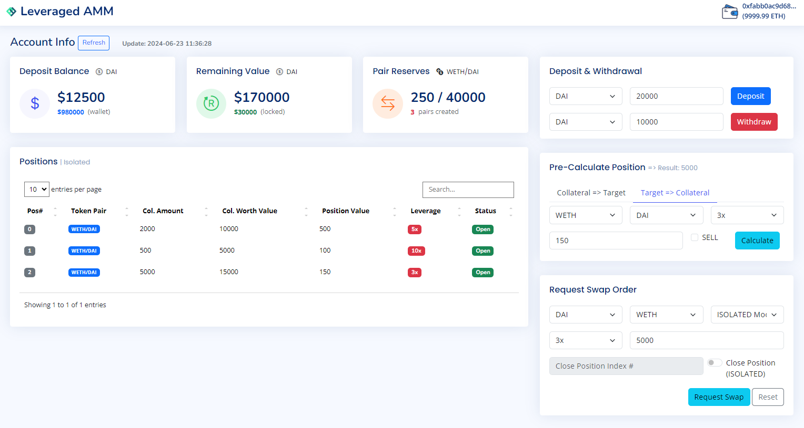

# Leveraged AMM Exchange Module

## Introduction
* These contracts are simplified version of a leveraged AMM exchange.
  - This exchange has the logic of an AMM exchange module: `(Rt + x) * (Ru + y) = Rt * Ru`.
* The contracts allow users to deposit/withdraw ERC20 tokens and swap tokens with leverage up to 10x.
* The contracts allow users to create arbitrary trading pairs (the swapped asset is called **position**).
* The contracts emit events for deposit, withdraw and swap functions.
* The contracts also provide a set of view functions, which can
  - input asset A amount as the payment and the leverage => returns obtained asset B amount after the swap
  - input asset A amount to exchange for and the leverage => returns asset A amount you should pay for
  - returns the remaining value of the account
* Users can open/reduce and open/close positions in cross and isolated margin modes, respectively.
  - In cross margin mode, the user's position is shared across all token swaps.
    * **OPEN**: buy tokens, **REDUCE**: sell tokens (part of or all).
  - In isolated margin mode, the user's position is isolated to each token swap.
    * **OPEN**: buy tokens, **CLOSE**: sell tokens in a specific single swap (all).
* A simple Web GUI (HTML) is also provided to interact with the contracts.

## Installation & Setup
### Framework
This project is established by `Foundry` framework. For installation, please refer to [Official Foundry Book](https://book.getfoundry.sh/getting-started/installation).


* Compile the Leveraged AMM Exchange Module contracts in the folder `src/`.
```bash
$ forge compile # or `forge build`
```


* Run the unit tests for the contracts, which are located in the folder `test/`.
```bash
$ forge test
================================================================================

[PASS] testFuzz_Deposit(uint256) (runs: 256, μ: 96684, ~: 97247)
[PASS] testFuzz_Withdraw(uint256) (runs: 256, μ: 110898, ~: 111472)
[PASS] test_AddReserves() (gas: 148919)
[PASS] test_AddReserves_Failed() (gas: 159666)
[PASS] test_CreatePair() (gas: 154154)
[PASS] test_CreatePair_Failed() (gas: 165411)
[PASS] test_Deposit() (gas: 96861)
[PASS] test_Deposit_Failed() (gas: 27677)
[PASS] test_Withdraw() (gas: 119422)
[PASS] test_Withdraw_Failed() (gas: 101115)
[PASS] test_GetAccountRemainingValue() (gas: 234000)
[PASS] test_GetAmountCollateralReturn() (gas: 184418)
[PASS] test_GetAmountInForOut() (gas: 172022)
[PASS] test_GetAmountOutFromIn() (gas: 165341)
[PASS] test_GetPairPrice() (gas: 156486)
[PASS] test_GetPositionId() (gas: 138955)
[PASS] test_MaxLeverage() (gas: 12037)
[PASS] test_Swap_Open_CrossMode() (gas: 428795)
[PASS] test_Swap_Reduce_CrossMode() (gas: 407240)
[PASS] test_Swap_Open_IsolatedMode() (gas: 906676)
[PASS] test_Swap_Close_IsolatedMode() (gas: 392260)
[PASS] test_Swap_Failed() (gas: 118890)
```


* Run the following command to see the testing coverage, which is also listed below.
```bash
$ forge coverage --ir-minimum --skip src/tests/*.sol script/*.sol
================================================================================

Ran 2 test suites in 395.11ms (766.41ms CPU time): 40 tests passed, 0 failed, 0 skipped (40 total tests)
| File                                     | % Lines          | % Statements     | % Branches     | % Funcs         |
|------------------------------------------|------------------|------------------|----------------|-----------------|
| src/LeveragedAMMExchangeCrossMode.sol    | 98.95% (94/95)   | 95.45% (147/154) | 84.21% (32/38) | 100.00% (19/19) |
| src/LeveragedAMMExchangeIsolatedMode.sol | 98.98% (97/98)   | 95.62% (153/160) | 82.35% (28/34) | 100.00% (20/20) |
| Total                                    | 98.96% (191/193) | 95.54% (300/314) | 83.33% (60/72) | 100.00% (39/39) |
```

### Deploy Contracts on Local Network
* To use the Web GUI, you should deploy the contracts on local blockchain network by [Anvil](https://book.getfoundry.sh/reference/anvil/) in `Foundry`.
  - **src/ILeveragedAMMExchange.sol**
  - **src/LeveragedAMMExchangeCrossMode.sol**
  - **src/LeveragedAMMExchangeIsolatedMode.sol**
  - **src/tests/MyToken.sol**
* Firstly, open another terminal and execute `Anvil` to run local network (by default setting).
* Make sure you have [Metamask](https://metamask.io/) installed in the web browser
  - Change the network setting to `Local` (RPC URL => [http://127.0.0.1:8545](http://127.0.0.1:8545))
```bash
$ anvil
```

* Rename the file `.env.example` with `.env`, copy one of the private key from the `Anvil` and paste it in the `.env`.
* Input this chosen private key into Metamask, and check whether there is some ethers in this account.
  - WARNING: DO NOT TAKE THE PRIVATE KEY AS YOUR OWN WALLET AND PUT THE REAL MONEY INTO IT.
* After updating the `.env` file, run the following commands to load the env variables and deploy the contracts.
```bash
$ source .env
$ forge script script/LeveragedAMMExchange.s.sol --rpc-url $RPC_URL --broadcast --private-key $PRIVATE_KEY
```

* Now we need to write the new depoloyed addresses of the contracts to the Web GUI config.
* Here, a simple script is provided to write the config (`html/contract-address.json`) automatically.
```bash
$ node load-address.js
```

* Install a VSCode extension [Live Server](https://marketplace.visualstudio.com/items?itemName=ritwickdey.LiveServer).
  - This can open the HTML files in a convenient way - like running on a web server.
* Right click on files: `html/exch-isolated-mode.html` & `html/exch-cross-mode.html` => `Open with Live Server`
  

## Static Analysis
* The contracts have been scanned by the static analysis tool [Slither](https://github.com/crytic/slither).
  - The reporting result from `Slither` is located in the folder `report/`.
